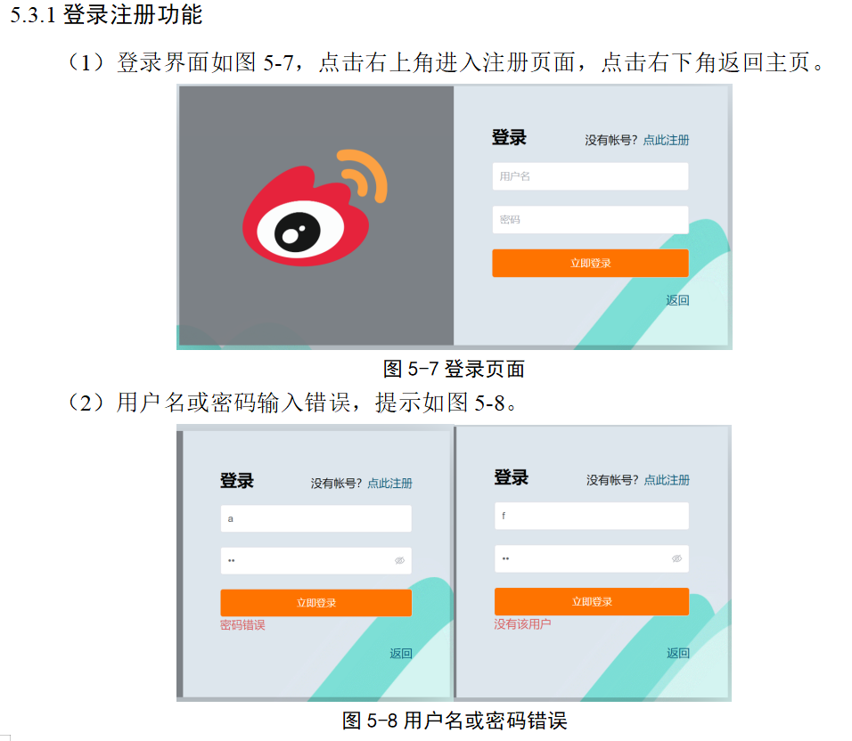
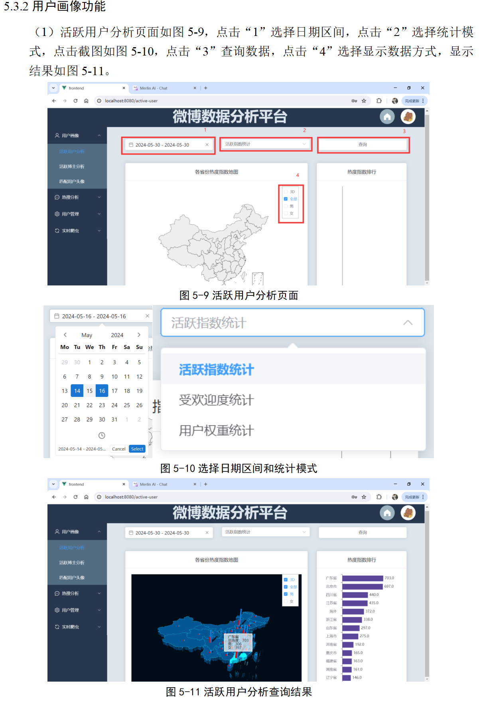
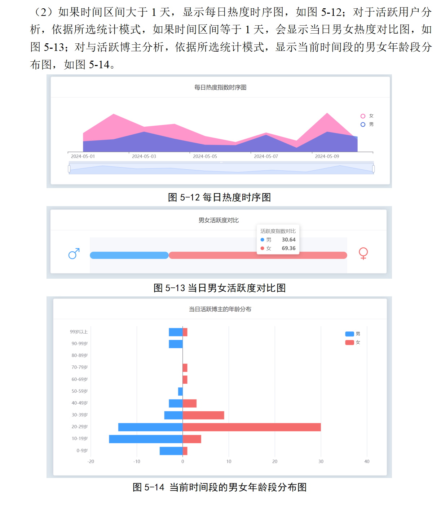
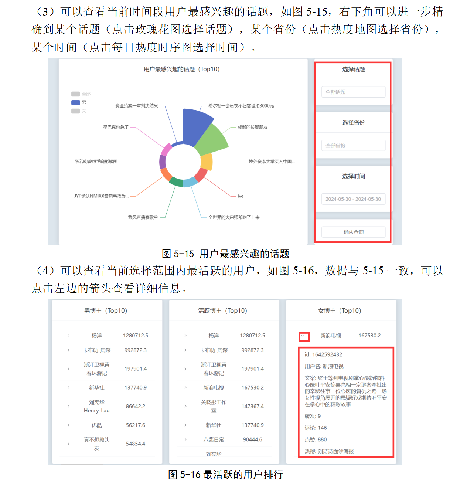
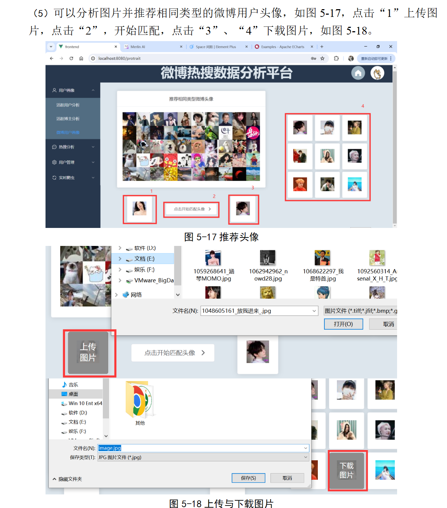
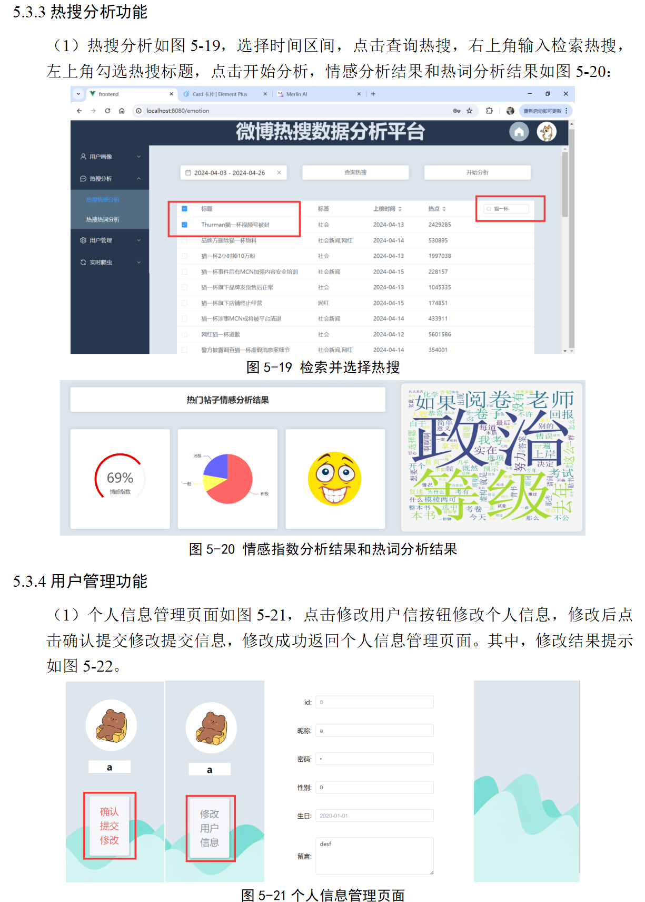
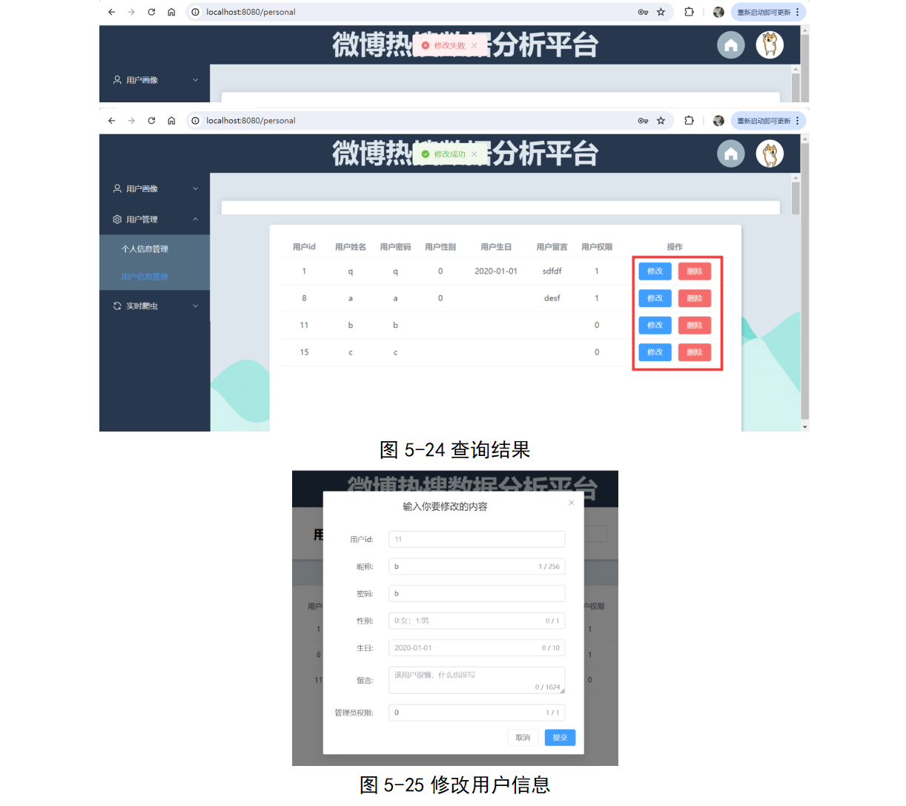
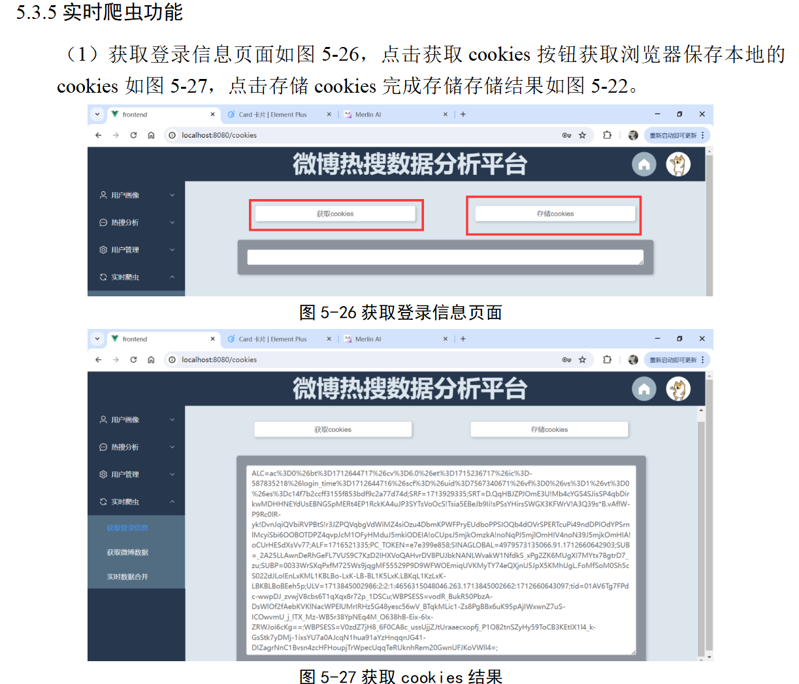
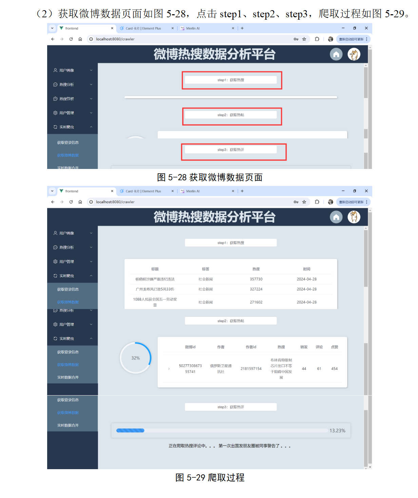
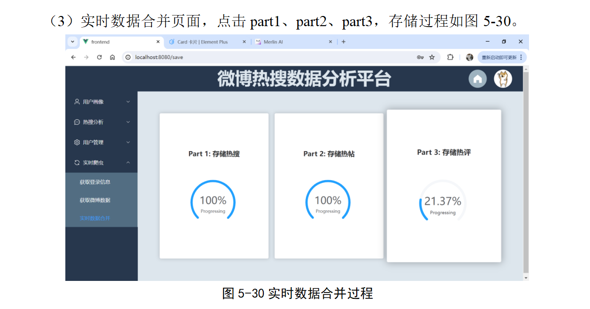

#  基于微博数据的数据分析网站，Python+Django+Vue3，内附爬虫代码和数据源，数据库采用MySQL

### 项目说明：

- 这是一个无聊大学生的无聊毕设，纯手工无添加，嫌界面丑的出门左拐
- 本代码禁止用于商业用途，包括但不限于窃取代码去B站等平台出售，严重警告!!!
- 交流群：435461117 | QQ：3533696826

### 项目描述：

本项目采用前后端分离的设计理念，前后端确定好数据接口后独立开发。本项目可以从以下几点开始阐述：

- 历史数据和实时数据：以2024年4月14日（实时爬虫功能上线）为分界线。截至5月31日项目结束共计数据100万条
- 核心功能：主要包括登录注册、用户画像、热搜分析、用户管理和实时爬虫五个核心功能
- 其他技术：网站采用Echarts绘图、网站设计过程中还涉及WebSocket技术、GNN对抗神经网络和闭包算法等其他有关技术

### 项目截图：

懒得写了，直接放论文截图：

